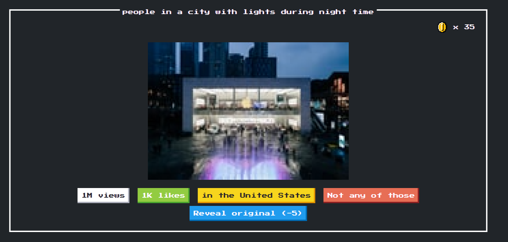

# Guess the pixels

Guess the pixels is a Vanilla JS retro game that uses Unsplash as a source of data. 

## Screenshot

## How to run

  - Generate your api key from https://unsplash.com/developers
  - Copy your key inside `server.js` or set it up as a node env parameter
  - `node server.js`
  - enjoy !

## todos and ideas

  - Add AI generated questions (maybe? :-) )
  - Dynamic questions based on the image data
  - Add levels (more or less pixels depending on level)

## Contributions

Either you found a bug, or want something implemented, go ahead and hack your way into the code, PRs are welcome.

## Credits

Nintendo owns the copyright of Kirby. Please comply with the Nintendo guidelines and laws of the applicable jurisdiction.

License
----

MIT
